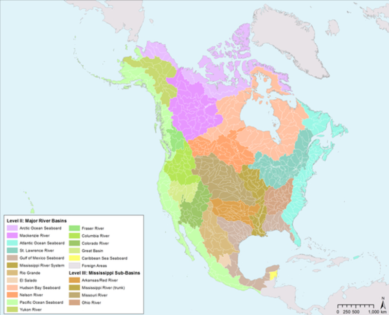

The atlas is a widely used literary form that usually groups maps,
graphs and text in order to systematically present a specific subject.
Halfway between scientific knowledge and popularization support[^1],
there are thousands of different atlases that are intended for various
audiences. Unlike the dictionary, the atlas does not aim at providing an
exhaustive vision of a subject but rather to bring light by exposing the
same subject in different ways.

> "*an
atlas is hardly made of\" pages \"in the usual sense of the term: rather
tables, boards where are arranged images, boards that we come to consult
for a specific purpose or that we serials at leisure, allowing to wander
our \"will to know\" from image to image and from plank to board*\"
Georges Didi-Huberman[^3]

Whether it is *My first Atlas* for 6-9 years or *the Official Atlas of
Patents* of the INPI, all in common to offer different levels of
reading. We do not read an atlas as we read a novel. We flip through it,
we look at the maps and the images, we read that chapter, we put it
down, we come back to it, we show it to other people, we cut out a map
to paste it elsewhere.

As in the cinema[^2], the atlas proceeds to a montage of images that
often already exist. Thanks to this editing, he produces unprecedented
knowledge not only by writing texts, but also by the choices of
juxtaposition and meetings he organizes. The atlas builds links in order
to allow the reader\'s imagination to project itself into a problematic
not in one fell swoop, but in successive touches.

## Selected References

Below you will find a set of examples of atlases chosen from thousands
of existing references, to reflect on how the atlases are designed, but
also how the atlas object was used, both as a geographical and
administrative tool, but also as a space for artistic and scientific
exploration.

### The Mercator Atlas (1589)

Gerardus Mercator (1589) - *Atlas Sive Cosmographicae Meditationes by
Fabrica Mundi and Fabricati Figura.*
([see the book](https://commons.wikimedia.org/wiki/Category:Atlas_Cosmographicae_(Mercator)))

The first card book using the term \"*Atlas*\" in its title. It was
created by the famous scientist Mercator, to whom we owe the famous
geographical projection that bears his name. The atlas includes maps of
Europe and poles and was created for Catherine de Cleves who wanted to
undertake a long journey around Europe. About half of the pages contain
maps, the rest of the explanatory texts on places and territories. It
can be noted that Mercator has never made geographical surveys but has
relied on the writings of many correspondents.

### The Underground Atlas of Paris (1855)

Underground Atlas of Paris (1855) - Fourcy
([consult online](https://patrimoine.mines-paristech.fr/document/Atlas_Fourcy_Paris_1859))

The 19th century in Europe sees a new fact: the metropolitan city. Under
the impetus of Napoleon III, Baron Haussman undertakes colossal work
that will transform the city of Paris from top to bottom. The
bureaucrats of the Second Empire embarked on major infrastructure
projects, such as sewers or roads, to accommodate a traffic increasingly
large. Numerous atlases are produced according to the topographic
surveys, allowing the Paris metropolitan project to become more readable
for the administration and real estate developers (Damme, 2015). These
atlases play a decisive role in the emergence of this science that is
now called urbanism.

### The Mnemosyne Atlas (1927-1929)

The Mnemosyne Atlas  (1927-1929) - Aby Warburg
([presentation](http://indexgrafik.fr/atlas-mnemosyne-aby-warburg/))

In December 1927, the art historian Aby Warburg undertakes to erect 40
wooden panels in the middle of his gigantic library. On each of them, he
creates compositions of images, paintings, reproduction, text to which
he gives each time a theme (astrology and mythology, archeological
models, etc.) Within each panel are mixed genres and epochs to form a
large fresco known as the *Mnemosyne Atlas*.

### The Atlas Group (1989-2004)

The Atlas Group (1989-2004) - Walid Raad -
[http://www.theatlasgroup.org](http://www.theatlasgroup.org/) (lebanon)

The Atlas Group is a project by the artist Walid Raad that presents
thirty years of war in Lebanon through a montage of literary and
audiovisual archives both real and fictional. The fictional character of
Dr. Fadl Fakhouri tells the war through testimonies and collected
elements, such as photos of the 245 car bombs found in Lebanon. The
artist uses the format of the atlas here to make not only visual but
also informational montages between scientific authority and media
invention.

### The Atlas of Movements (2003)

Atlas of Movements (2003) - Christopher Fink
([Book](http://www.merpaperkunsthalle.org/projects/view/169)
/ [Archive](https://www.mleuven.be/en/christoph-fink#) /
[Presentation](http://fr.forumviesmobiles.org/hanja-maksim/blog/2015/06/23/christoph-fink-informations-objectives-et-experience-subjective-2902))

Christopher Fink has for many years documented the relationship between
space and time by documenting how our bodies move. His work is based on
precise descriptions of \"the experience of mobility\". Photos,
drawings, sound recordings, maps, sketches and diagrams: the artist
records precisely his movements by multiplying the graphic experiments.
Thus, it cuts step by step its walks, imagine notations systems for
different times and activities, etc. Rather than proposing a unique
approach, it offers us a vast archive of representations and
measurements of movements.

### The Archives of the Planet (1909-1931 / 2016) - Albert Kahn

Archives of the Planet (1909-1931 / 2016) - Albert Kahn
([Site](http://collections.albert-kahn.hauts-de-seine.fr/)
/ [Open Data](https://www.opendatasoft.fr/2016/06/06/les-archives-de-la-planete-d-albert-kahn-en-open-data/))

The *Archives of the Planet* is a collection of over 4000 autochromes
(ancestor of glass photography) collected by the wealthy French banker
Albert Kahn. Passionate about the diversity of world cultures, Kahn
commissioned hundreds of photographs of places and people far and wide
around the globe. Begun in 1912 in the Department of Human Geography
College de France, this great photographic collection has recently been
published online under a free license. The General Council of
Hauts-de-Seine has undertaken to create a map-based interface to view
photos.

### The Atlas of the Natural Regions (2017)

The Atlas of the Natural Regions (2017) - Eric Tabuchi & Nelly Monnier
[https://atlasrn.fr](https://atlasrn.fr)

The Atlas of the Natural Regions is a project initiated by a
photographer and an artist with the aim of producing over 10 years fifty
photographs in each of the 500 natural regions of France. Each region
covers about ten square kilometers, bounded by natural geographical
markers, such as mountains or streams. The creation of these 25,000
photographs is accompanied by regular publications on the site. At the
same time, the artists keep a diary that explains the places and
describes the conditions of the shots.

### The Atlas of Cyberspace (2001)

Atlas of Cyberspace (2001) - Martin Dodge & Robert Kitchin
([contents](http://www.kitchin.org/atlas/contents.html))

The Cyberspace Atlas of the English geographers Dodge and Kitchin is one
of the first serious and systematic attempts at \"*cybergraphy*\".
Popularized by the science fiction and writings of Gibson, cyberspace
has gradually earned its acclaim with the arrival of the Internet. The
challenge is not only to understand what is happening in the networks,
but to show the porosities between supposed \"virtual\" worlds and the
\"real\" world. The atlas lists a lot of maps and representations, but
also a set of interfaces. It strikes with its futuristic aesthetic
typical of the 2000s, with a strong trend for ballistic neon, and a
clear desire to celebrate the new technology of the Internet (Desbois,
2011).

### The Critical Atlas of the Internet (2016)

Critical Atlas of the Internet (2016) - Louise Druhle
[http://internet-atlas.net](http://internet-atlas.net)
([lab](http://louisedrulhe.fr/lab/))

*Critical Atlas of the Internet* is Louise Druhle, realized as part of
her degree at ENSAD. He proposes to approach the question of the
representation of the Internet in 15 themes and questions. For each
question, Druhle drew a set of diagrams or 3D models, accompanied by
quotes often from books discussing our relationship to the Internet.
Designed as a website, the navigation offers a long scrolling vertical
scroll to read question by question. Taking the multiple sizes and
dimensions of our screens, the atlas has been printed in different sizes
thanks to a suite of open-source tools \"*web to print*\" which allows
to convert a web page into PDF.

### Le dessous des cartes

Le dessous des cartes (1990-now) - ARTE / The Seven
([site](https://www.arte.tv/fr/videos/RC-014036/le-dessous-des-cartes/))

Le dessous des cartes is a French public educational program created by the geographer Jean-Christophe Victor in 1990. Each program lasting from 7
to 11 minutes follows the same format: presentation by the moderator of
the topic of the day, a demonstration based on maps, figures or
animation accompanied by voice-overs, then the end of the presenter. The
program, which has been successful for the past 30 years, is based on
rigorous cartographic representations and deals with often local topics
(continents, regions or countries).

### The Environmental Atlas of North America (2014)

Environmental Atlas of North America (2014) - NAAEC
([site](http://cec.org/tools-and-resources/north-american-environmental-atlas))

The *Environmental Atlas of North America* is a publication gathering
environmental data in Canada, the United States and Mexico under the
coordination of the Commission for Environmental Cooperation. Rarely,
the organization brings together the three countries to aggregate data
across the continent. On the site are interactive maps, but also data
and maps for download as well as expert reports. Most of the data comes
from sensors or weather stations in the three countries.

### The Atlas of Economic Complexity (2011)

The Atlas of Economic Complexity (2011) - Hausmann et al
[http://atlas.cid.harvard.edu](http://atlas.cid.harvard.edu/)

*The Atlas of Economic Complexity* is a work of Harvard researchers and
MIT Media Lab that aims to explore economic relations between 128
countries according to a set of data and statistics on trade. The atlas
provides for each country a detailed statistical sheet on its trade
relations with other countries, as well as numerous maps and diagrams
representing global trade. Published in 2011 in the form of a book, the
atlas was nonetheless conceived as a web application for querying a
central database and displaying graphs. Analyzes were then produced
country by country before being compiled in the final book.

### Our World in Data (2016-now)

Our World in Data (2016-now) - Max Roser
[https://ourworldindata.org](https://ourworldindata.org/)

*Our World in Data* is an online publication by economist and historian
Max Roser of Oxford University who wishes to present empirical evidence
of changing living conditions in the world. The project is interested in
documenting the implications of economic development around the world.
Different analyzes are performed or commissioned to subject-by-subject
specialists to cover a wide range of issues. All the data is available
for download and the figures are freely licensed so that they can be
easily re-used.

Cover credits : Adam Reeder[^4]

[^1]: Thomas, Gaëtan. \"Atlas, Or The Problem of the Scientific
    Imagination.\" Nonfiction.fr, October 23, 2012.
    [https://www.nonfiction.fr/article-6165-atlas\_ou\_le\_le\_probleme\_de\_limagination\_scientifique.htm](https://www.nonfiction.fr/article-6165-atlas_ou_le_probleme_de_limagination_scientifique.htm).

[^2]: Castro, Teresa. *Cartographic Thinking Images. Cinema and Visual
    Culture,* Lyon, Aléas, 2011.

[^3]: Didi-Huberman, Georges. *Atlas ou le gai savoir inquiet: L'œil de l'histoire 3*, Paris : Les Éditions de Minuit, coll. "Paradoxe", 2011. 384 p.

[^4]: Adam Reeder, *Greek sculpture with iPod*, 2016 -  [Wikipedia Commons](https://commons.wikimedia.org/wiki/File:Greek-sculptures-with-iPod_2.jpg)
